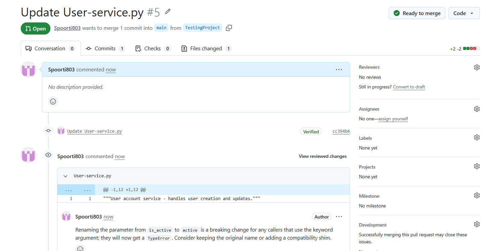
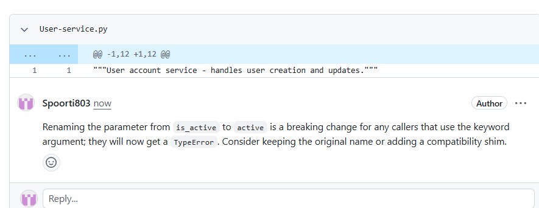
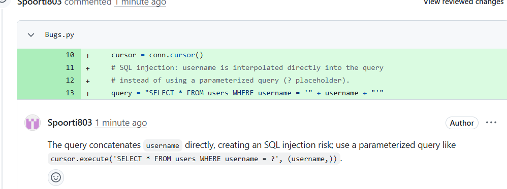
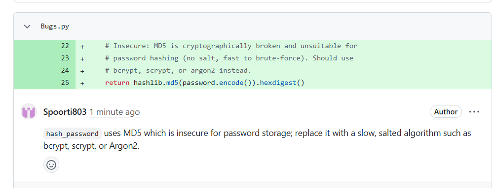
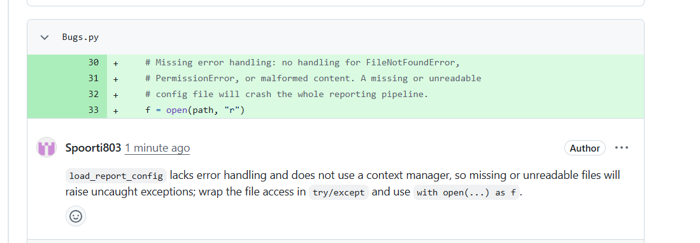
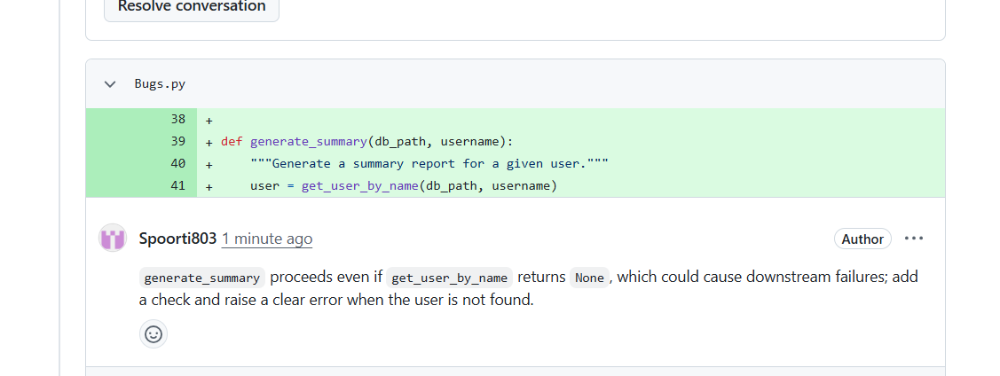

# PR Review Bot

Automated GitHub PR review bot using Tree-sitter for code context and Claude/GPT-4o for AI-generated inline comments.

An automated code review bot that listens to GitHub pull request events, retrieves rich code context using Tree-sitter, and posts inline review comments via an LLM (Groq, Google Gemini, Anthropic Claude, or OpenAI GPT-4o).

Manual code review is thorough but slow, inconsistent, and bottlenecked by reviewer availability — PRs pile up faster than humans can get to them, especially in open-source projects with external contributors. Existing automated tools each fall short in a different way: CodeRabbit and GitHub Copilot Review are commercial and subscription-gated, SonarQube can't reason about intent or context (rule-based only), and Snyk/DeepCode focus narrowly on security. This project combines AST-based semantic context extraction (via Tree-sitter) with LLM reasoning, stays open and configurable, and supports free-tier LLM options — filling a gap none of the above fully cover.

**Performance (from end-to-end testing):** webhook responses in under 150ms, complete reviews delivered within 45 seconds, all 16 unit/integration tests passing. Validated on real PRs across Python and JavaScript codebases, successfully catching SQL injection risks, insecure cryptographic function use, missing error handling, and breaking API changes.

## Example output

**Catching a breaking change via caller-context analysis** — a function parameter was renamed (`is_active` → `active`). The change looks harmless in isolation, but the bot searched the rest of the codebase, found a caller still using the old keyword argument, and flagged the exact `TypeError` this would cause:




**Catching real security issues** — SQL injection from string-concatenated queries, insecure MD5 password hashing, and missing error handling on file I/O:





The bot also independently caught an issue that wasn't deliberately planted — a missing `None` check that could cause a downstream failure:




---

## Table of Contents
1. [How it works](#how-it-works)
2. [Context retrieval algorithm](#context-retrieval-algorithm)
3. [Supported languages](#supported-languages)
4. [Prerequisites](#prerequisites)
5. [Project structure](#project-structure)
6. [Installation](#installation)
7. [Configuration](#configuration)
8. [Running the bot](#running-the-bot)
9. [Setting up the GitHub webhook](#setting-up-the-github-webhook)
10. [Exposing localhost with ngrok (for development)](#exposing-localhost-with-ngrok-for-development)
11. [Testing](#testing)
12. [Cost & rate limits](#cost--rate-limits)
13. [Known limitations](#known-limitations)
14. [Troubleshooting](#troubleshooting)
15. [Contributing](#contributing)
16. [License](#license)

---

## How it works

```
Developer opens PR
        |
        v
GitHub sends webhook  ---->  FastAPI (/webhook)
                                   |
                                   | verifies HMAC-SHA256 signature
                                   v
                              Redis queue  ---->  200 OK returned to GitHub
                                   |
                                   v
                          Celery worker picks up job
                                   |
                     +-------------+--------------+
                     |                             |
             Fetch PR diff                 Parse changed files
             (GitHub API)                  and line numbers
                     |                             |
                     +-------------+--------------+
                                   |
                                   v
                     Tree-sitter: extract full function
                     bodies + callers, ±20 context lines
                                   |
                                   v
                     Rank & select top 5-8 snippets
                                   |
                                   v
                     Build prompt  ---->  LLM (Claude / GPT-4o)
                                   |
                                   v
                     Parse JSON response
                                   |
                                   v
                     Post inline review comments to GitHub PR
```

1. A developer opens a Pull Request on GitHub.
2. GitHub fires a webhook `POST /webhook` to your server.
3. FastAPI receives it, verifies the HMAC-SHA256 signature, and drops a job into **Redis**.
4. FastAPI instantly responds `200 OK` to GitHub (so GitHub doesn't time out).
5. A **Celery** worker picks up the job and runs the context retrieval pipeline:
   - Fetches the PR diff via the GitHub API.
   - Parses changed files and line numbers.
   - Gathers ±20 surrounding lines for context.
   - Extracts full function bodies and their callers using **Tree-sitter**.
   - Ranks and selects the top 5–8 most relevant snippets.
6. Builds a prompt and sends it to the LLM (Claude or GPT-4o).
7. Parses the JSON response and posts inline review comments back to GitHub.

---

## Context retrieval algorithm

This is the core of the project — everything lives in `app/context.py` and is orchestrated by `app/tasks.py`. It runs once per changed hunk in a PR and produces a ranked list of code snippets to hand to the LLM.

### 1. Surrounding lines (`get_surrounding_lines`)

For each changed hunk, the bot fetches a fixed ±20-line window around the first changed line of that hunk (clamped so the start never goes below line 1):

```python
start = max(1, changed_line - window)   # window defaults to 20
end   = changed_line + window
```

These lines are pulled directly from GitHub via the contents API (`get_file_lines`) at the PR's head commit, not from a local clone.

### 2. Enclosing function extraction (`extract_function`)

The surrounding lines are parsed into a Tree-sitter AST (Python or JS/TS/JSX/TSX grammar, selected by file extension). The tree is walked recursively looking for any node whose type is one of:

- `function_definition` (Python)
- `function_declaration`
- `method_definition`
- `arrow_function`

Among all matching nodes whose line range contains the changed line, the **smallest** one (fewest lines) is kept — this picks the innermost enclosing function rather than an outer wrapper when functions are nested. The function's name is read off its first `identifier` child, and the full source text of that node is returned along with its start/end line numbers. If no parser exists for the file extension, or no enclosing function is found, this step is skipped and the snippet falls back to diff-only context.

### 3. Caller lookup (`find_callers`)

If a function name was resolved, the bot searches the rest of the repository for that identifier using GitHub's code search API (`search_code`), then narrows the results with the AST rather than trusting the text match: each candidate file is parsed, and the tree is walked for `call` / `call_expression` nodes whose callee text contains the function name. Each match records the filename, line number, and the raw source line as a snippet. Up to 2 call sites are kept per file, and the whole list is capped at `max_callers` (default 5) across all files. This is what lets the bot catch things like a renamed keyword argument breaking a caller elsewhere in the codebase — see the [example output](#example-output) above.

### 4. Ranking & selection (`rank_and_select`)

Every snippet (surrounding lines + function body + callers, one per changed hunk) is scored with a fixed linear formula before the top ones are kept:

```python
score = changed_count * 3 + fn_len * 0.1 + caller_count * 2
```

- `changed_count` — number of added/removed lines (`+`/`-`) in that hunk
- `fn_len` — number of lines in the extracted function body (0 if extraction failed)
- `caller_count` — number of caller call-sites found for that function

Snippets are sorted by this score, descending, and truncated to `max_snippets` (the pipeline calls this with **7**). This keeps prompt size bounded on large PRs while prioritizing hunks that touch more code, sit in larger functions, or have more call sites elsewhere (i.e. higher blast radius). The weights (3, 0.1, 2 — labeled α, β, γ in the project's write-up) are hand-picked, not empirically tuned; see [Research status & open roadmap](#research-status--open-roadmap) for a note on that.

---

## Supported languages

Tree-sitter context extraction currently supports:

- **Python** (`tree-sitter-python`)
- **JavaScript** (`tree-sitter-javascript`)

The design targets Python, JavaScript, TypeScript, JSX, and TSX via Tree-sitter's language-specific parsers; grammars beyond Python/JS can be added following the same pattern (see [Contributing](#contributing)). Unsupported languages fall back to diff-only context (no function/caller extraction).

## How this compares to existing tools

| Tool | Approach | Limitation |
|---|---|---|
| CodeRabbit | LLM-based review | Commercial, expensive for small teams |
| GitHub Copilot Review | LLM suggestions | Limited to Copilot subscribers |
| SonarQube | Rule-based static analysis | Cannot reason about context or intent |
| DeepCode (Snyk) | ML pattern matching | Focuses on security only |
| **This project** | Context-aware LLM + AST | Open, configurable, supports free LLM tiers |

The gap this project targets: a system that combines semantic AST-based context extraction with LLM reasoning, stays open-source and configurable, supports free LLM tiers, and integrates natively with GitHub's PR workflow.

---

## Prerequisites

Install these before anything else:

| Tool | Version | Install |
|------|---------|---------|
| Python | 3.11+ | https://python.org |
| Redis | 7+ | https://redis.io/docs/install |
| Git | any | https://git-scm.com |
| ngrok (dev only) | any | https://ngrok.com |

You also need accounts/tokens for:
- **GitHub** — a Personal Access Token (PAT) with `repo` scope.
- **Anthropic** or **OpenAI** — an API key for the LLM.

---

## Project structure

```
pr_review_bot/
├── app/
│   ├── __init__.py
│   ├── main.py            # FastAPI app + webhook endpoint
│   ├── worker.py          # Celery app definition
│   ├── tasks.py           # Celery task: full review pipeline
│   ├── github_client.py   # GitHub API helpers
│   ├── diff_parser.py     # Parse unified diffs
│   ├── context.py         # Tree-sitter context retrieval
│   ├── prompt_builder.py  # Build LLM prompt
│   └── llm_client.py      # Call Claude / GPT-4o
├── tests/
│   ├── test_diff_parser.py
│   ├── test_context.py
│   └── test_webhook.py
├── .env.example
├── .gitignore
├── requirements.txt
├── LICENSE
└── README.md
```

---

## Installation

### 1. Clone and enter the project

```bash
git clone https://github.com/YOUR_USERNAME/pr_review_bot.git
cd pr_review_bot
```

### 2. Create a virtual environment

```bash
python -m venv venv
source venv/bin/activate        # macOS / Linux
# venv\Scripts\activate         # Windows
```

### 3. Install dependencies

```bash
pip install -r requirements.txt
```

### 4. Install Tree-sitter language grammars

Tree-sitter needs compiled language binaries. Run this once:

```bash
python -c "
from tree_sitter import Language
import subprocess, os

# Download grammars
for repo in [
    'https://github.com/tree-sitter/tree-sitter-python',
    'https://github.com/tree-sitter/tree-sitter-javascript',
]:
    name = repo.split('/')[-1]
    if not os.path.exists(name):
        subprocess.run(['git', 'clone', '--depth=1', repo])

Language.build_library(
    'build/languages.so',
    ['tree-sitter-python', 'tree-sitter-javascript'],
)
print('Tree-sitter grammars built.')
"
```

> **Note:** these cloned grammar folders (`tree-sitter-python/`, `tree-sitter-javascript/`) are build-time dependencies, not part of the source tree — they're gitignored and rebuilt locally via the command above rather than committed.

### 5. Start Redis

```bash
# macOS (Homebrew)
brew services start redis

# Ubuntu / Debian
sudo systemctl start redis-server

# Or run in Docker
docker run -d -p 6379:6379 redis:7
```

Verify Redis is running:
```bash
redis-cli ping   # should print: PONG
```

---

## Configuration

Copy `.env.example` to `.env` and fill in your values:

```bash
cp .env.example .env
```

`.env.example` looks like this:

```env
# GitHub
GITHUB_TOKEN=ghp_your_personal_access_token_here
GITHUB_WEBHOOK_SECRET=a_random_string_you_choose

# LLM — pick one
ANTHROPIC_API_KEY=sk-ant-...
OPENAI_API_KEY=sk-...          # optional, only if using GPT-4o
LLM_PROVIDER=anthropic         # "anthropic" or "openai"

# Redis
REDIS_URL=redis://localhost:6379/0
```

> **Never commit your real `.env` file.** It's already listed in `.gitignore`, but double-check with `git status` before every commit if you're new to git.

**How to get a GitHub PAT:**
1. Go to GitHub → Settings → Developer settings → Personal access tokens → Tokens (classic).
2. Click "Generate new token".
3. Select scopes: `repo` (full control of private repos).
4. Copy the token — it's only shown once.

**Choosing a webhook secret:**
- Just pick any random string, e.g. run `python -c "import secrets; print(secrets.token_hex(32))"`.
- You'll paste this same string into the GitHub webhook settings later.

---

## Running the bot

You need **three terminal windows** (or use a process manager like `honcho`).

### Terminal 1 — FastAPI server

```bash
source venv/bin/activate
uvicorn app.main:app --host 0.0.0.0 --port 8000 --reload
```

You should see: `Uvicorn running on http://0.0.0.0:8000`

### Terminal 2 — Celery worker

```bash
source venv/bin/activate
celery -A app.worker worker --loglevel=info
```

You should see: `celery@hostname ready.`

> On Windows, use `--pool=solo` for local development (`celery -A app.worker worker --loglevel=info --pool=solo`). This runs one task at a time — fine for testing, but not meant for production concurrency. For production, use `--pool=prefork` on Linux with multiple workers.

### Terminal 3 — Redis (if not running as a service)

```bash
redis-server
```

---

## Setting up the GitHub webhook

### Step 1 — Expose your local server (development)

See the [ngrok section](#exposing-localhost-with-ngrok-for-development) below to get a public URL.

### Step 2 — Add the webhook to your GitHub repo

1. Go to your repo on GitHub → **Settings** → **Webhooks** → **Add webhook**.
2. Fill in:
   - **Payload URL**: `https://YOUR_NGROK_URL/webhook`
   - **Content type**: `application/json`
   - **Secret**: the same value as `GITHUB_WEBHOOK_SECRET` in your `.env`
   - **Which events?** → Select "Pull requests"
3. Click **Add webhook**.
4. GitHub will send a test ping. You should see a green checkmark.

---

## Exposing localhost with ngrok (for development)

ngrok creates a public HTTPS tunnel to your local machine.

```bash
# Install (if not done)
brew install ngrok       # macOS
# or download from https://ngrok.com/download

# Authenticate (once, free account)
ngrok config add-authtoken YOUR_NGROK_TOKEN

# Start tunnel
ngrok http 8000
```

ngrok will show something like:
```
Forwarding   https://abc123.ngrok.io -> http://localhost:8000
```

Use `https://abc123.ngrok.io` as your webhook base URL.

> **Note:** The free ngrok URL changes every time you restart ngrok. Update your GitHub webhook URL whenever this happens. The `ngrok.exe` binary itself is not tracked in this repo — download it directly from ngrok.com for your platform.

---

## Testing

Run the test suite:

```bash
pytest tests/ -v
```

### Manual end-to-end test

1. Make sure all three services are running (FastAPI, Celery, Redis).
2. Open a real pull request in your repo (or re-open a draft PR).
3. Wait ~10–30 seconds.
4. Refresh the PR page — you should see inline review comments posted by the bot.

### Test the webhook endpoint manually

```bash
curl -X POST http://localhost:8000/webhook \
  -H "Content-Type: application/json" \
  -H "X-Hub-Signature-256: sha256=PLACEHOLDER" \
  -d '{"action":"opened","pull_request":{"number":1,"head":{"sha":"abc"}},"repository":{"full_name":"owner/repo"}}'
```

---

## Cost & rate limits

- Each LLM call scales with prompt size — large PRs with many changed files mean larger prompts and higher per-review cost. Consider capping the number of files/snippets reviewed per PR.
- Watch GitHub API rate limits (5,000 requests/hour for authenticated PATs) if you're running this against many repos or high PR volume.
- Watch your LLM provider's rate limits and token quotas (Anthropic/OpenAI), especially under concurrent Celery workers.
- No built-in cost cap currently exists in this project — add one (e.g. max tokens per prompt, max files per PR) if running this against a busy repo.

---

## Known limitations

- **Single points of failure**: if Redis or the Celery worker goes down mid-job, that review silently fails unless retries/persistence are configured.
- **`--pool=solo` in dev**: fine for local testing, but processes one task at a time — not representative of production throughput.
- **No CI/CD pipeline yet**: nothing currently prevents accidental commits of `.env` or secrets; consider adding a pre-commit hook or GitHub Action to scan for secrets.
- **ngrok URLs rotate on restart** (free tier): requires manually updating the GitHub webhook payload URL each time during development.
- **Limited language support**: Tree-sitter context extraction only covers Python and JavaScript today.

---

## Troubleshooting

| Problem | Fix |
|---------|-----|
| `redis.exceptions.ConnectionError` | Redis isn't running. Start it with `redis-server`. |
| `HMAC signature mismatch` | Your `GITHUB_WEBHOOK_SECRET` in `.env` doesn't match what you set in GitHub. |
| Celery task never runs | Check Terminal 2 — the Celery worker must be running and connected to Redis. |
| No comments posted | Check `GITHUB_TOKEN` has `repo` scope. Check the LLM API key is correct. Look at Celery logs for errors. |
| Tree-sitter `languages.so` not found | Re-run the build step in the Installation section. |
| ngrok URL expired | Restart ngrok and update the GitHub webhook Payload URL. |

---

## Research status & open roadmap

This project began as a research submission (evaluated on 100+ real pull requests, comparing diff-only vs. diff+surrounding-context vs. the full Tree-sitter-based pipeline — see results below). It was submitted to an academic venue and was **not accepted in its current form**. The core engineering and evaluation are solid, but reviewers felt it wasn't yet positioned as a research contribution. If you're interested in taking this further — academically or otherwise — here's exactly what's needed, straight from reviewer feedback:

1. **Baseline comparison against existing tools.** The current evaluation only compares this project's own three internal configurations against each other. To make a stronger case, compare against an established tool (e.g. GitHub Copilot PR reviews, CodeRabbit, or a plain "GPT-4o with full diff, no Tree-sitter" baseline).
2. **Sharper novelty claim.** The most interesting contribution here is likely the **caller-graph context retrieval** (seeing which functions call a changed function, not just the function itself — see the parameter-rename example in the results below). A stronger paper would center this specifically and isolate its contribution via ablation, rather than treating it as one row in a results table.
3. **Deeper experimental validation.** Currently reported as one aggregate table across 100+ PRs. Reviewers wanted to see: breakdowns by issue type / PR size / language, statistical significance testing between configurations, and a systematic (not just anecdotal) error analysis of false positives/negatives.
4. **Justification for scoring weights.** The relevance-scoring formula uses fixed constants (α=3.0, β=0.1, γ=2.0 — see Table 2 in the paper). Right now these are intuition-based; empirically tuning them (or running an ablation without one term) would strengthen the design section significantly.

### Evaluation results (for reference)

| Configuration | Precision | Recall | F1-Score |
|---|---|---|---|
| Diff-only | 0.77 | 0.77 | 0.77 |
| Diff + Surrounding | 0.71 | 0.89 | 0.79 |
| **Full pipeline** | **0.88** | 0.75 | **0.81** |

Full pipeline achieves the best precision and F1. Notably, it was the only configuration that correctly caught cases where a developer renamed a function parameter — harmless within the function itself, but breaking several callers elsewhere in the codebase that passed arguments by name. Diff-only and surrounding-context configurations had no visibility into those callers and missed this class of bug entirely.

The raw per-PR evaluation data (human-identified issues vs. bot-flagged issues per pull request) was not preserved after the original evaluation run — see `compute_metrics.py` in this repo for a script to recompute precision/recall/F1 from scratch if you re-run the evaluation.

If you build on this and get it published, or just want to talk through ideas, feel free to open an issue or reach out — happy to hear how it goes.

---

## Contributing

Contributions are welcome. To add support for a new language:

1. Add the corresponding Tree-sitter grammar repo to the build step in `context.py`.
2. Update `Language.build_library` calls to include the new grammar.
3. Add tests under `tests/` covering function/caller extraction for the new language.
4. Update the [Supported languages](#supported-languages) section above.

For general contributions:
1. Fork the repo and create a feature branch.
2. Run `pytest tests/ -v` before opening a PR — all tests must pass.
3. Keep PRs focused and small where possible.

---

## License

Licensed under the [MIT License](LICENSE). You're free to fork, modify, and reuse this code — including commercially — as long as the original copyright notice in `LICENSE` is preserved.

If this project is useful in your own research or work, an informal citation/mention linking back to this repository is appreciated (not required).
